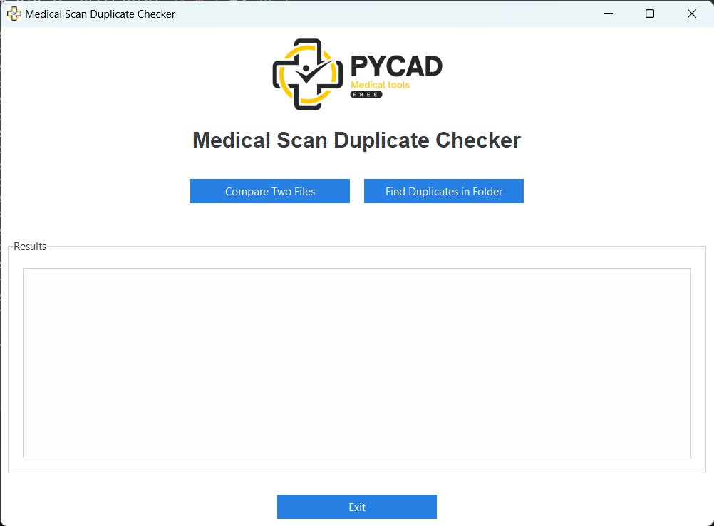

# No-developer guidelines
This guidelines is for users who want to use the app without the need to run the code.

## Download the app
You can download the app from the [releases](https://github.com/amine0110/scan-duplicate-checker/releases) page.

## Install Python
If you don't have Python installed, you can download it from the [official website](https://www.python.org/downloads/). Or you can install it from the Microsoft Store. Please see the video below to see how to install it from the Microsoft Store.

## Run the app
You can run the app by clicking on the `ScanChecker.bat` file.

The steps that will happen behind the scenes are:
1. Check if Python is installed on your system.
2. Create a virtual environment to isolate the app's dependencies.
3. Activate the virtual environment.
4. Install the required dependencies from the `requirements.txt` file.
5. Run the main application (`app.py`).
6. After the application closes, deactivate the virtual environment.

These steps ensure that the app runs in a controlled environment with the correct dependencies, without affecting your system-wide Python installation.
